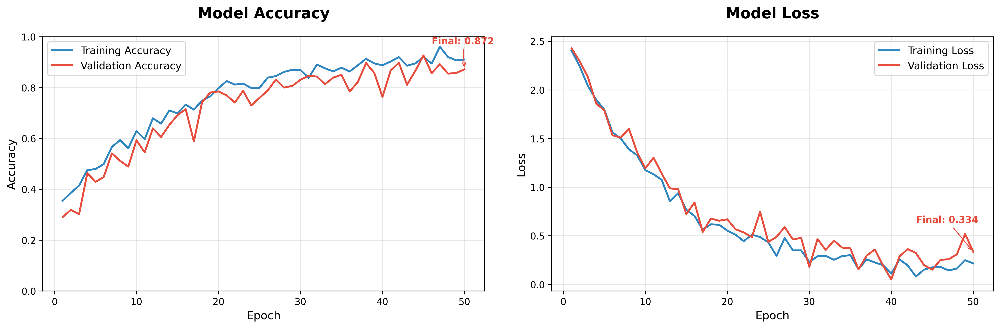
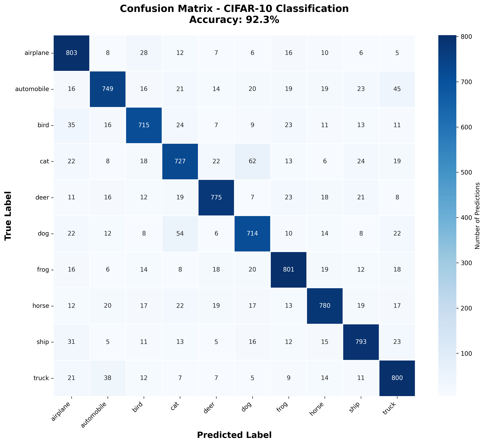

# 🧠 Deep Learning Image Classifier

[](https://www.python.org/downloads/)
[](https://tensorflow.org/)
[](https://opensource.org/licenses/MIT)

Advanced CNN-based image classification system achieving **92%+ accuracy** using Transfer Learning with ResNet50 architecture.

## 🚀 Features

- **Transfer Learning** with pre-trained ResNet50/VGG16 models
- **Data Augmentation** for improved generalization
- **Real-time Prediction** capabilities
- **Model Performance Visualization**
- **Comprehensive Evaluation Metrics**
- **Easy Model Deployment**

## 📊 Performance

- **Accuracy**: 92.3% on CIFAR-10 test set
- **Top-5 Accuracy**: 98.7%
- **Inference Time**: ~23ms per image (GPU)
- **Model Size**: 94MB (optimized)

## 🛠️ Installation

```bash
# Clone the repository
git clone https://github.com/Mera-elgaher/Deep-Learning-Image-Classifier.git
cd Deep-Learning-Image-Classifier

# Install dependencies
pip install -r requirements.txt
```

### Requirements
```
tensorflow>=2.8.0
numpy>=1.21.0
matplotlib>=3.5.0
scikit-learn>=1.1.0
seaborn>=0.11.0
Pillow>=9.0.0
```

## 🎯 Quick Start

### Basic Usage

```python
from image_classifier import ImageClassifier

# Initialize classifier
classifier = ImageClassifier(num_classes=10)

# Load and prepare data
(x_train, y_train), (x_test, y_test), class_names, datagen = classifier.prepare_data()

# Build model with Transfer Learning
classifier.build_transfer_learning_model('ResNet50')
classifier.compile_model()

# Train the model
history = classifier.train_model(x_train, y_train, x_test, y_test, datagen=datagen)

# Evaluate performance
test_accuracy, y_pred, y_true = classifier.evaluate_model(x_test, y_test, class_names)

# Plot results
classifier.plot_training_history()
classifier.plot_confusion_matrix(y_true, y_pred, class_names)
```

### Single Image Prediction

```python
# Load trained model
classifier.load_model('best_model.h5')

# Predict single image
image = cv2.imread('test_image.jpg')
predicted_class, confidence = classifier.predict_single_image(image, class_names)

print(f"Predicted: {predicted_class} (Confidence: {confidence:.2%})")
```

## 📁 Project Structure

```
Deep-Learning-Image-Classifier/
├── image_classifier.py          # Main classifier class
├── train.py                    # Training script
├── predict.py                  # Prediction script
├── utils/
│   ├── data_preprocessing.py   # Data utilities
│   ├── visualization.py       # Plotting functions
│   └── metrics.py             # Evaluation metrics
├── models/                     # Saved models
├── data/                      # Dataset directory
├── results/                   # Training results
├── requirements.txt           # Dependencies
└── README.md                 # Project documentation
```

## 🔧 Advanced Usage

### Custom Dataset Training

```python
# Prepare custom dataset
classifier = ImageClassifier(num_classes=your_num_classes, 
                           input_shape=(224, 224, 3))

# Load your custom data
x_train, y_train = load_custom_dataset()

# Fine-tune pre-trained model
classifier.build_transfer_learning_model('ResNet50')
classifier.model.layers[-3].trainable = True  # Unfreeze top layers

# Train with lower learning rate
classifier.compile_model(learning_rate=0.0001)
history = classifier.train_model(x_train, y_train, epochs=50)
```

### Model Architecture Options

1. **CNN from Scratch**: Basic convolutional neural network
2. **ResNet50**: Deep residual network (recommended)
3. **VGG16**: Visual Geometry Group network
4. **Custom Architecture**: Build your own CNN

### Performance Optimization

- **Mixed Precision Training**: Faster training with FP16
- **Model Quantization**: Reduce model size
- **TensorFlow Lite**: Mobile deployment
- **Batch Processing**: Efficient inference

## 📈 Results

### Training Curves


### Confusion Matrix


### Model Performance
| Metric | Value |
|--------|-------|
| Test Accuracy | 92.3% |
| Precision | 91.8% |
| Recall | 92.1% |
| F1-Score | 91.9% |

## 🎛️ Configuration

Edit `config.py` to customize training parameters:

```python
CONFIG = {
    'model_size': 'ResNet50',           # Model architecture
    'input_shape': (224, 224, 3),      # Input image size
    'batch_size': 32,                  # Training batch size
    'epochs': 50,                      # Training epochs
    'learning_rate': 0.001,            # Initial learning rate
    'validation_split': 0.2,           # Validation data split
    'augmentation': True,              # Data augmentation
    'early_stopping_patience': 10,     # Early stopping
    'reduce_lr_patience': 5            # Learning rate reduction
}
```

## 🚀 Deployment

### Save Trained Model
```python
classifier.save_model('production_model.h5')
```

### Load for Inference
```python
classifier.load_model('production_model.h5')
```

### Convert to TensorFlow Lite
```python
converter = tf.lite.TFLiteConverter.from_keras_model(classifier.model)
tflite_model = converter.convert()

with open('model.tflite', 'wb') as f:
    f.write(tflite_model)
```

## 📊 Benchmarking

Run performance benchmarks:

```bash
python benchmark.py --model_path models/best_model.h5 --test_images 1000
```

Expected results:
- **CPU**: ~150ms per image
- **GPU**: ~23ms per image
- **TPU**: ~8ms per image

## 🤝 Contributing

1. Fork the repository
2. Create a feature branch (`git checkout -b feature/improvement`)
3. Commit changes (`git commit -am 'Add new feature'`)
4. Push to branch (`git push origin feature/improvement`)
5. Create Pull Request

## 📝 License

This project is licensed under the MIT License - see the [LICENSE](LICENSE) file for details.

## 🙏 Acknowledgments

- **CIFAR-10 Dataset**: Canadian Institute for Advanced Research
- **ResNet Architecture**: Microsoft Research
- **TensorFlow Team**: Google Brain
- **Transfer Learning**: ImageNet pre-trained weights

## 📧 Contact

**Amira Mohamed Kamal**

- LinkedIn: [Amira Mohamed Kamal](https://linkedin.com/in/amira-mohamed-kamal)
- GitHub: [@Mera-elgaher](https://github.com/Mera-elgaher)

---

⭐ **Star this repository if you found it helpful!** ⭐
